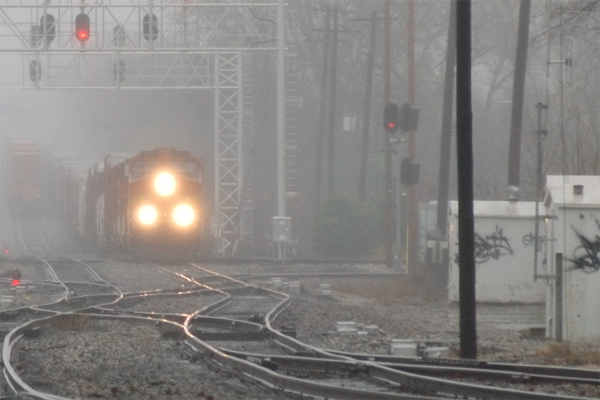
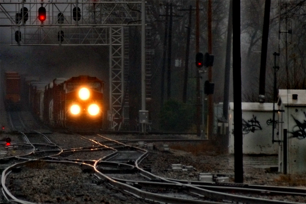

# cv-work

> [!IMPORTANT]
> Just a homework~

## Task1

> [!NOTE]
> 本实验是对于 2009 CVPR 何凯明《Single image haze removal using dark channel prior》Python 代码的简单复现

🎨 使用方式
```bash
cd task1
python 1.py -i [/path/to/input_image] -o [/path/to/output_image]
```

> [!NOTE]
> 效果


[](https://imgsli.com/MjI5MTA2) [](https://imgsli.com/MjI5MTA3)

## Task2

> [!WARNING]
该实验主要研究 tinyface 的检测，使用之前较为流行的 Tiny-Face (论文 [Finding Tiny Faces](https://arxiv.org/abs/1612.04402))，以及 YOLO5Face (论文 [Why Reinventing a Face Detector](https://arxiv.org/abs/2105.12931)) 作为对比实验。

(1). 模型配置及使用：

* Tiny-Face 采用：HR-ResNet101 结构 
* Yolov5-Face 采用：ShuffleNetv2 作为骨架的 ***YOLOv5n***

(2). 二者在 **原论文** 的表现（使用 WIDERFace 数据集的 val 部分）：

|     Name     | Easy  | Medium | Hard  |
| :----------: | :---: | :----: | :---: |
| HR-ResNet101 | 0.919 | 0.908  | 0.823 |
|   yolov5n    | 0.936 | 0.915  | 0.805 |

(3). 实验准备：

* **下载**：[WIDER 数据集](http://shuoyang1213.me/WIDERFACE/)，以及 [wider_val.txt](https://drive.google.com/file/d/1Twa2YSAxaRzy-SnOx0ZA3J3p8BUM14uN/view?usp=sharing)
  * 为了简便实验流程，我们只需要在验证集上测试两种模型性能
    * 将数据集 WIDER 放到 `/cv-work/data`
    * 将 wider_val.txt 放到 `/cv-work/data/WIDER/WIDER_val`
* **环境**：
  * `conda create -n {name} python=3.11`
  * `conda activate {name}`
* **Tiny-Face**
  * 在 `/cv-work/task2/weights` 目录下放置 [checkpoint_50.pth](https://www.dropbox.com/scl/fi/md0lxok2uh2achx8r58mk/checkpoint_50.pth?rlkey=9y1acwj1k6c57tqck14t6as18&e=1&dl=0) 
* **Yolov5-Face**
  * 在 `/cv-work/task2/weights` 目录下放置 [yolov5n-face.pt](https://drive.google.com/file/d/18oenL6tjFkdR1f5IgpYeQfDFqU4w3jEr/view?usp=sharing)


> [!TIP]
> 项目结构

```markdown
# task2
- tiny-face
- data
  - WIDER
    - ...
    - WIDER_val
      - images
      - wider_val.txt
- yolov5-face
- weights
  - checkpoint_50.pth
  - yolov5n-face.pt
```


(4). 一键实验
> [!TIP]
> 当你处理好了 Python 环境时，那么我们可以使用 Makefile，具体指令可以参考 Makefile 的内容：

✨ 获取 tiny-face 以及 yolov5-face 结果
```bash
make exp1 && make exp2
```
✨ 获取他们的 mAP 结果
```bash
make test1 && make test2
```

(5). 参考
1. https://github.com/varunagrawal/tiny-faces-pytorch
2. https://github.com/deepcam-cn/yolov5-face

## Task3
